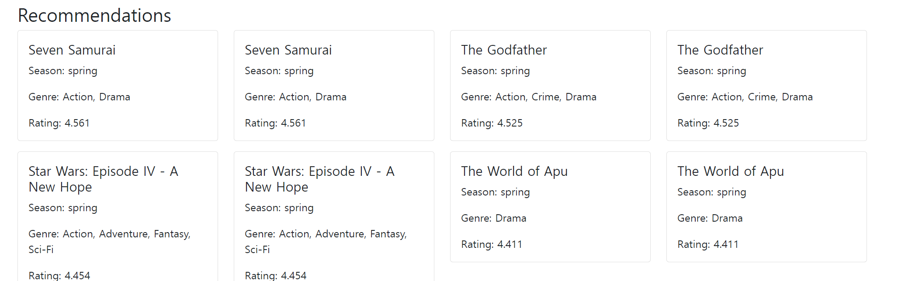

# CSE364-unist group 7 - User documentation

This is guideline for user who want to enjoy our UniMovie service.

-**The commit name 'root' is 'JungwooMoon-20191352' because he commit by ubuntu system** 

## Before start

### For Part 3

According to Piazza's answer we do not need to implent '.yml' file. But we have to provide evidence of 'Continuous Integration'.

This is our progress...

* For first generation we didn't implement 'Face-swap' and 'Movie Predict' feature. So, in first commit you click the 'Face-swap' and 'Movie Predict' you can't get any page.
But you can access 'Movie Recommendaiton'.

* Second commit, we add 'Face-swap' feature, so when we test the code in local, we can see the 'Face-swap' page and feature is adding.

* Third commit, we add 'Movie Predict' feature, so when we test the code in local, we can see the 'Movie Predict' page and feature is adding.

* For case of Read.md commit we add each part' feature description.

* The case of 'Deploy Application', we can use our app not in localhost.

## What is UniMovie App about

The app provides...
* The seasonal movie recommendation system to solve users' concerns about choosing a movie due to the overflowing ott system

* The face-swap system to satisfy their fun and desire to appear in a movie

* The movie prediction system to inform users of information by predicting the success of a movie before releasing it or watching it in a movie theater

## How it works and How to use by Each page and what each page does

### 1. Main page

This is main page of our UniMovie App. And we can interact with our feature using bars abvoe of the page. 
This page is just Homepage. Therefore, the aim is to give users a choice of three features.

Here is our menu bar. And all page have menu bar.

* If user click Home button user will come back to the main page, wnhereever user locate other feature.
* If user click Movie Recommendations button, user will go to our movie recommendation feature page.
* If user click Face Swap with Movie Poster, user will go to our Face Swap feature page.
* If user click Movie Success Predict, user will go to our Movie Prediction feature page.

### 2. Movie Recommendation Page

This is the page of our Movie Recommendation feature. user can interact with bars above the page to interact with other feautre.
And also user can use our UI to get the movie recommendation by season and genre.

User can choose 4 season which are 'summer', 'winter', 'spring', 'fall'. And user can optionally choose genre which have 18 category.

User have to click 'Get Top 10 Recommendation' Button first, because we want to show users to the recommended movies that we are most confident in. So, when user click the 'Get Top 10 Recommendation' Button, user can press 'Get Random Recommendation' Button.
So, every time user change the genre and season, user must click the 'Get Top 10 Recommendation' Button first.

This is the output that we provide for users. Output contains the data which are 'movie_name', 'season', 'genre', 'rating'. 
If user don't like the result user can change the input of season and genre or user can press 'Get Random Recommendation' Button.

If user want to recommend movie, user have to choose season. 
If user didn't choose season and press the 'Recommendaiton Button'. User can see the 'Error message'. 
But genre is optional, so user can recommend movie only provide season without genre.

### 3. Face swap page
## What it does?
This feature generates new movie poster with replacing the character's face with the user's face.

## How it works?
You should upload both your face iamge and movie poster(please upload the images that clearly shows the face to generate nice quality of poster)
Then, click the 'convert' button. (It will take about 2 minutes, if you are the first user for our website, it would take 6 minutes :( )

## How to save?
After the loading, our page shows the converted image and provided 'save' button. User can simply click the 'save' button to download the converted poster image.

### 4. Movie Success Prediction Page

This is the page for our Movie Success Prediction feature. Users can fill out a form to predict the success of a movie based on various factors.

1. Fill in the form with the required details such as director name, duration, genres, budget, etc.
2. Click the 'Predict!' button to submit the form.

The result will indicate whether the movie is predicted to be a 'HIT', 'AVG', or 'FLOP'. 
Based on the prediction, users can make informed decisions about watching or investing in a movie.

